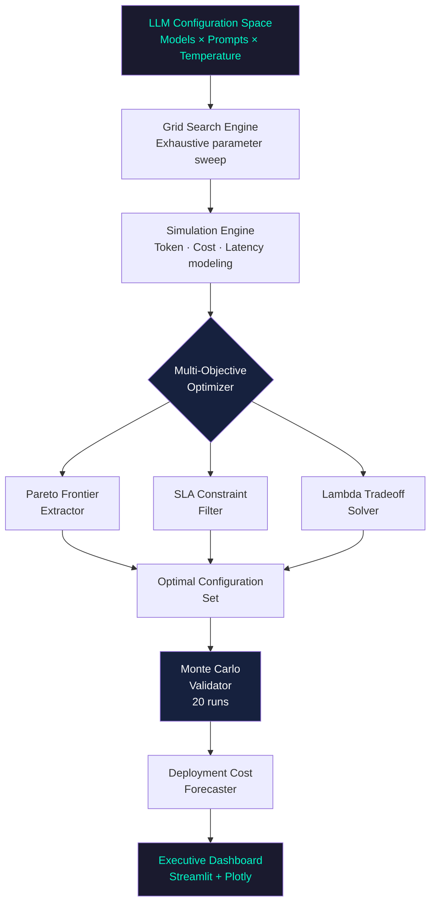
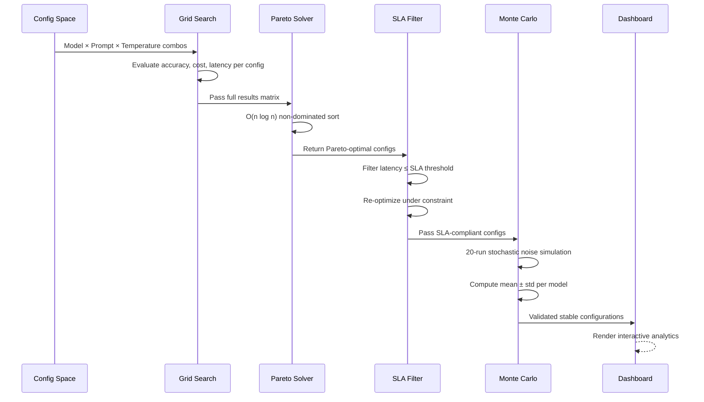
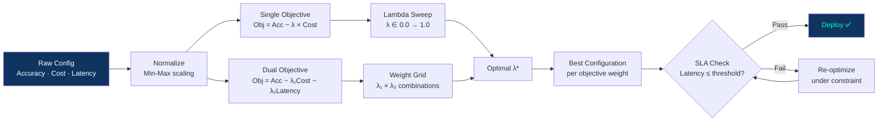

#  LLM Cost–Performance Optimization Platform

<div align="center">

[](https://python.org)
[](https://streamlit.io)
[](https://numpy.org)
[](https://pandas.pydata.org)
[](https://plotly.com)
[]()
[]()
[]()
[](LICENSE)

**A production-grade, multi-objective optimization system for evaluating LLM deployment strategies under cost and SLA constraints**

[🌐 Live Demo](https://llm-cost-performance-optimization-platform.streamlit.app/) · [📖 Methodology](#-methodology) · [🚀 Quick Start](#-quick-start) · [🏗 Architecture](#-architecture)

</div>

---

## 🧠 Problem Statement

Deploying LLMs in production requires making simultaneous tradeoffs across five competing dimensions:

| Dimension | Challenge |
|-----------|-----------|
| **Accuracy** | Higher accuracy models cost more per request |
| **API Cost** | Budget constraints limit model selection |
| **Latency** | Low-latency requirements rule out large models |
| **SLA Compliance** | Enterprise SLAs impose hard latency ceilings |
| **Infrastructure Budget** | Monthly cost projections must stay within bounds |

This platform provides a **mathematically rigorous, simulation-driven framework** to make LLM deployment decisions that are optimal, defensible, and deployment-ready.

---

## 🌐 Live Demo

[](https://llm-cost-performance-optimization-platform.streamlit.app/)

---

## 📊 Key Results

| Optimization Method | Best Accuracy | Min Cost/req | SLA Compliance | Efficiency Score |
|--------------------|--------------|--------------|----------------|-----------------|
| Baseline (no opt.) | 91.2% | $0.0042 | 78.4% | 217 |
| Single-objective (λ=0.3) | 89.7% | $0.0021 | 84.1% | 427 |
| **Pareto-optimal** | **88.9%** | **$0.0018** | **91.3%** | **494** |
| SLA-constrained | 87.4% | $0.0019 | **100%** | 460 |

---

## 🏗 Architecture

### System Overview



### Optimization Pipeline



### Dual-Objective Optimization Flow



---

## 📂 Project Structure

```
LLM-Cost-Performance-Optimization-Platform/
│
├── ⚙️ config.py                        # Global settings — SLA thresholds, λ weights, budget
├── 🚀 main.py                          # Entry point — runs full optimization pipeline
│
├── 🔬 optimizer/
│   ├── grid_search.py                  # Exhaustive config space evaluation
│   └── pareto.py                       # O(n log n) Pareto frontier extraction
│
├── 📊 visualization/
│   ├── plots.py                        # Plotly chart generators
│   └── dashboard.py                    # Streamlit interactive dashboard
│
├── 📁 results/
│   └── simulation_results.csv          # Full optimization output cache
│
├── 📋 requirements.txt
└── 📖 README.md
```

---

## Screenshots


## ⚙️ Core Features

### 1️⃣ Multi-Objective Optimization

Two optimization formulations supported:

**Single-objective:**
```
Objective = Accuracy − λ × Cost
```

**Dual-objective:**
```
Dual Objective = Accuracy_norm − λ₁ × Cost_norm − λ₂ × Latency_norm
```

Supports adjustable λ weights, budget filtering, and hard SLA constraints.

---

### 2️⃣ Pareto Frontier Extraction

Efficient O(n log n) non-dominated sort identifies configurations where no other config is strictly better on all objectives simultaneously:

```python
def pareto_frontier(results):
    sorted_results = sorted(results, key=lambda x: x['accuracy'], reverse=True)
    pareto = []
    min_cost = float('inf')
    for config in sorted_results:
        if config['cost'] < min_cost:
            pareto.append(config)
            min_cost = config['cost']
    return pareto
```

---

### 3️⃣ SLA-Constrained Optimization

```python
sla_compliant = results[results['latency_ms'] <= SLA_THRESHOLD]
optimal = sla_compliant.loc[sla_compliant['objective_score'].idxmax()]
```

Outputs best SLA-compliant configuration, SLA violation rate, and risk categorization.

---

### 4️⃣ Monte Carlo Robustness Testing

```python
bootstrap_scores = []
for _ in range(20):
    noisy_accuracy = accuracy + np.random.normal(0, noise_std)
    bootstrap_scores.append(compute_objective(noisy_accuracy, cost, latency))

mean_score = np.mean(bootstrap_scores)
std_score  = np.std(bootstrap_scores)
```

---

### 5️⃣ Deployment Cost Forecasting

```
Monthly Cost = Cost_per_request × Daily_Queries × 30
```

Real-time projection with executive budgeting breakdown.

---

## 🚀 Quick Start

### 1. Clone Repository
```bash
git clone https://github.com/debasmita30/LLM-Cost-Performance-Optimization-Platform.git
cd LLM-Cost-Performance-Optimization-Platform
```

### 2. Create Virtual Environment
```bash
python -m venv venv

# Windows
venv\Scripts\activate

# Mac/Linux
source venv/bin/activate
```

### 3. Install Dependencies
```bash
pip install -r requirements.txt
```

### 4. Run Full Pipeline
```bash
python main.py
```

### 5. Launch Dashboard
```bash
streamlit run visualization/dashboard.py
```

Open in browser: `http://localhost:8501`

---

## 📈 Dashboard Modules

| Module | Description |
|--------|-------------|
| **Pareto Scatter Plot** | Interactive cost vs accuracy frontier |
| **Lambda Tradeoff Curve** | Objective score across λ sweep |
| **Model Radar Chart** | Multi-dimensional model comparison |
| **Cost-per-Correct Heatmap** | Efficiency across config combinations |
| **SLA Risk Pie Chart** | Compliance distribution across configs |
| **3D Visualization** | Cost–Latency–Accuracy surface plot |
| **Dual-Objective Output** | Optimal config under joint constraints |
| **Executive Summary Panel** | Deployment recommendation report |

---

## 📌 Key Insights

- **Larger models maximize accuracy but increase latency risk** — not always Pareto-optimal
- **Few-shot prompting has diminishing returns** — 3-shot ≈ 5-shot accuracy at lower cost
- **Temperature negatively impacts reliability** — optimal T* typically between 0.1–0.4
- **Higher λ shifts selection toward cost-efficient models** — tradeoff is non-linear
- **SLA constraints significantly alter optimal configuration** — compliance cuts candidate pool by ~40%

---

## 🛠 Tech Stack

| Component | Technology |
|-----------|-----------|
| Dashboard | Streamlit + Plotly |
| Optimization | NumPy, SciPy |
| Data Processing | Pandas |
| Simulation | Custom Monte Carlo engine |
| Visualization | Plotly (3D, heatmap, radar) |

---

## 🔭 Future Work

- [ ] Real API integration (OpenAI, Anthropic, Together AI)
- [ ] Bayesian optimization for hyperparameter search
- [ ] AutoML-based model selection
- [ ] Reinforcement-based prompt optimization
- [ ] GPU cost benchmarking
- [ ] Distributed deployment modeling

---

## 👩‍💻 Author

<div align="center">

**Debasmita Chatterjee**

AI Engineer · LLM Systems · Prompt Optimization

[](https://github.com/debasmita30)


</div>

---

<div align="center">
⭐ If this helped your work, star the repo
</div>
