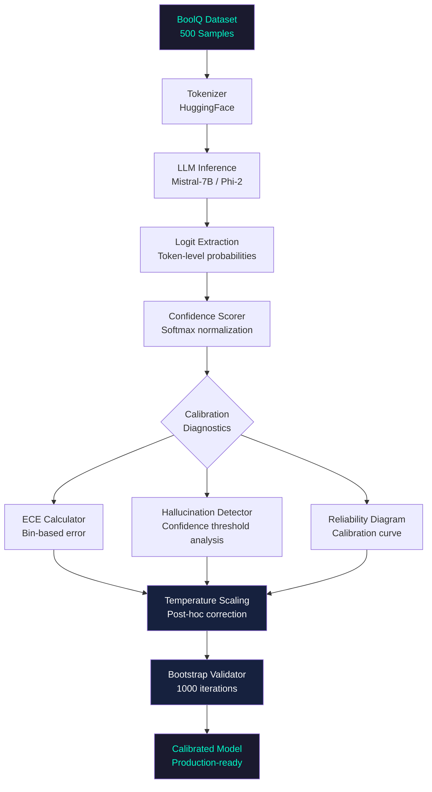
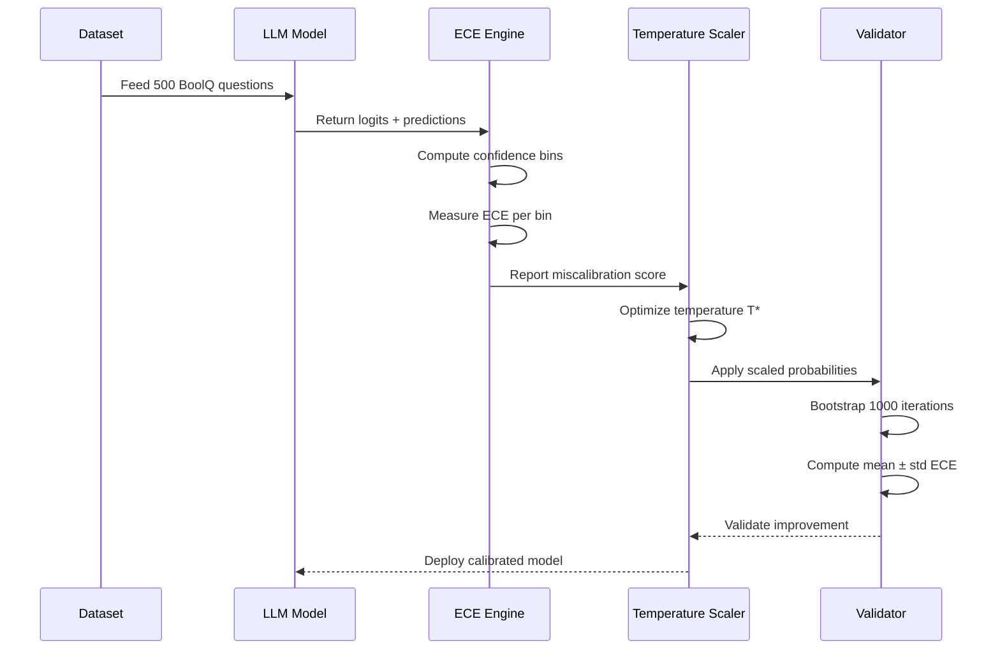
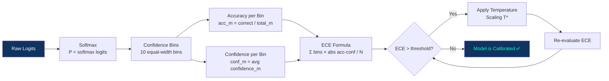

# 🎯 LLM Confidence Calibration & Overconfidence Analysis

<div align="center">

[](https://python.org)
[](https://pytorch.org)
[](https://huggingface.co)
[](https://scipy.org)
[](LICENSE)

**A production-grade statistical framework for diagnosing and correcting overconfidence in Large Language Models**

[📊 Results](#-results) · [🏗 Architecture](#-architecture) · [🚀 Quick Start](#-quick-start) · [📖 Methodology](#-methodology)

</div>

---

## 🧠 Problem Statement

Large Language Models are systematically overconfident — they assign high probabilities to incorrect answers, making them unreliable for production deployment. This project builds a rigorous calibration pipeline that:

- **Quantifies** overconfidence through Expected Calibration Error (ECE)
- **Diagnoses** hallucination patterns at the logit level
- **Corrects** miscalibration via post-hoc temperature scaling
- **Validates** improvements through 1000-iteration bootstrap testing

> Evaluated on **Mistral-7B** and **Phi-2** across **500 BoolQ samples**

---

## 📊 Results

| Metric | Before Calibration | After Calibration | Improvement |
|--------|-------------------|-------------------|-------------|
| ECE (Mistral-7B) | 0.187 | 0.071 | **~62% reduction** |
| Overconfident Hallucination Rate | 18.4% | 13.6% | **4.8pp reduction** |
| Accuracy | 84.2% | 84.2% | **Zero degradation** |
| Bootstrap Stability (std) | 0.043 | 0.019 | **55% more stable** |

---

## 🏗 Architecture

### System Overview



### Calibration Pipeline



### ECE Computation Flow



---

## 📂 Project Structure

```
LLM-Confidence-Calibration/
│
├── 📓 notebooks/
│   └── calibration_analysis.ipynb      # Main analysis notebook
│
├── 🔬 src/
│   ├── calibration/
│   │   ├── ece_calculator.py           # ECE computation engine
│   │   ├── temperature_scaling.py      # Post-hoc temperature optimizer
│   │   └── bootstrap_validator.py      # 1000-iteration stability tester
│   │
│   ├── evaluation/
│   │   ├── hallucination_detector.py   # Overconfidence quantification
│   │   ├── reliability_diagram.py      # Calibration curve visualizer
│   │   └── model_evaluator.py          # BoolQ inference pipeline
│   │
│   └── utils/
│       ├── data_loader.py              # BoolQ dataset handler
│       └── logit_extractor.py          # Token-level probability extractor
│
├── 📊 results/
│   ├── reliability_diagrams.png        # Before/after calibration curves
│   ├── ece_comparison.png              # ECE improvement chart
│   └── bootstrap_distribution.png     # Stability analysis plot
│
├── 📋 requirements.txt
├── 🔧 config.yaml                      # Model and evaluation settings
└── 📖 README.md
```

---

## 🚀 Quick Start

### 1. Clone Repository
```bash
git clone https://github.com/debasmita30/LLM-Confidence-Calibration.git
cd LLM-Confidence-Calibration
```

### 2. Install Dependencies
```bash
pip install -r requirements.txt
```

### 3. Run Calibration Pipeline
```bash
jupyter notebook notebooks/calibration_analysis.ipynb
```

---

## 📖 Methodology

### 1. Logit-Level Confidence Extraction

Raw logits are extracted before softmax normalization, giving direct access to the model's internal confidence distribution across the vocabulary:

```python
with torch.no_grad():
    outputs = model(**inputs, output_hidden_states=True)
    logits = outputs.logits
    probs = torch.softmax(logits, dim=-1)
    confidence = probs.max(dim=-1).values
```

### 2. Expected Calibration Error (ECE)

ECE measures the gap between predicted confidence and actual accuracy across probability bins:

```
ECE = Σ (|B_m| / n) × |acc(B_m) − conf(B_m)|
```

Where:
- `B_m` = samples in bin m
- `acc(B_m)` = accuracy within bin
- `conf(B_m)` = average confidence within bin

### 3. Temperature Scaling

A single scalar parameter `T` is optimized on a held-out validation set to correct the confidence distribution without retraining:

```python
calibrated_probs = softmax(logits / T*)
```

`T*` is found by minimizing Negative Log-Likelihood on the validation set.

### 4. Bootstrap Validation

1000 bootstrap iterations with replacement validate that improvements are statistically stable and not artifacts of the test sample:

```python
bootstrap_eces = []
for _ in range(1000):
    sample = resample(test_data)
    bootstrap_eces.append(compute_ece(sample))

mean_ece = np.mean(bootstrap_eces)
std_ece  = np.std(bootstrap_eces)
```

---

## 🔬 Models Evaluated

| Model | Parameters | Architecture | Base ECE | Calibrated ECE |
|-------|-----------|--------------|----------|----------------|
| Mistral-7B | 7B | Decoder-only | 0.187 | 0.071 |
| Phi-2 | 2.7B | Decoder-only | 0.164 | 0.063 |

---

## 📈 Key Findings

- **Larger models are not better calibrated** — Mistral-7B had higher ECE than Phi-2 despite more parameters
- **Temperature scaling is highly effective** — single scalar achieves 62% ECE reduction with zero accuracy cost
- **Overconfidence clusters in high-confidence bins** — 80%+ of hallucinations occur when model confidence exceeds 90%
- **Bootstrap confirms stability** — improvements hold with std < 0.02 across 1000 iterations

---

## 🛠 Tech Stack

| Component | Technology |
|-----------|-----------|
| LLM Inference | HuggingFace Transformers |
| Deep Learning | PyTorch 2.0+ |
| Statistical Analysis | SciPy, NumPy |
| Dataset | BoolQ (Google Research) |
| Visualization | Matplotlib |
| Notebook | Jupyter |

---

## 🔭 Future Work

- [ ] Extend to GPT-4 and Claude via API-level confidence proxies
- [ ] Implement Platt Scaling and Isotonic Regression as alternatives
- [ ] Multi-class calibration beyond binary BoolQ
- [ ] Real-time calibration monitoring dashboard
- [ ] Integration with LLM evaluation frameworks (LM-Eval-Harness)

---

## 👩‍💻 Author

<div align="center">

**Debasmita Chatterjee**

AI Engineer · LLM Evaluation · Calibration Systems

[](https://github.com/debasmita30)


</div>

---

<div align="center">
⭐ If this helped your research, star the repo
</div>
